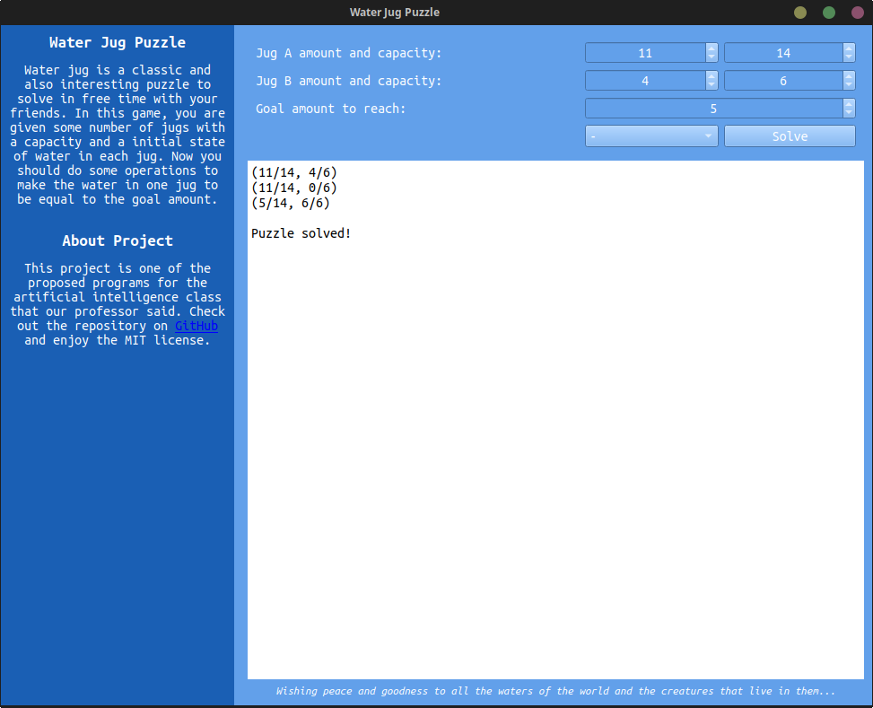
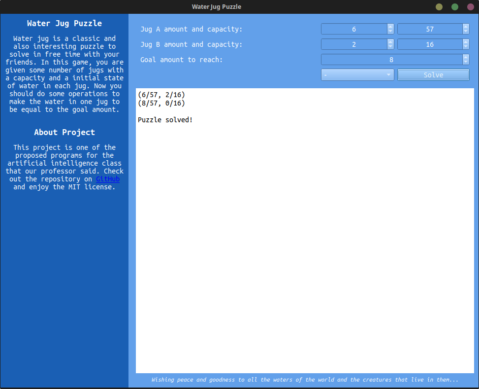
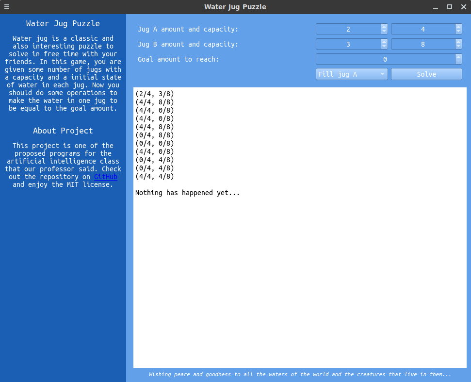
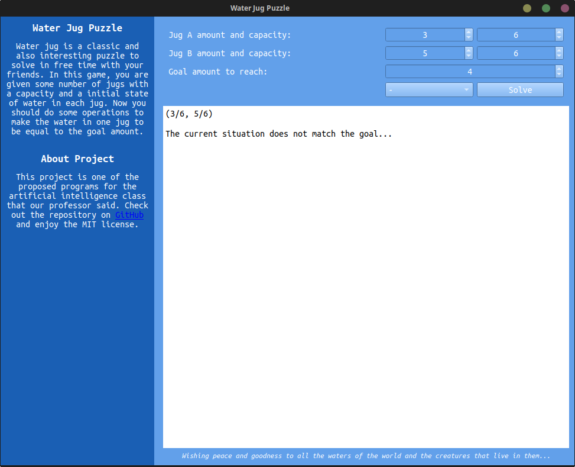

## Water Jug Puzzle From Scratch


Water jug is a classic and also interesting puzzle to solve. You are given some number of jugs with a capacity and a initial state of water in each jug. Now you should do some operations to make the water in one jug to be equal to the goal amount.

This puzzle in computer science is usually solved in two ways; the simplest way is to act step by step and the other is to use trees to show all possible situations ahead. Here I will try to implement the simplest way.


### Rules

There is no any formal strategy and you have to make one for yourself... Just kidding, you can use some standard answers for specific situations!

Let's solve a few examples to understand it better, but before that we have to respect some limitations. The operations you can perform are:

- Empty a jug
- Fill a jug
- Pour water from one jug to another until one of the jugs is ethier full or empty

### Examples

<i>Read the states like this: (amount of jug A/capacity of jug A, amount of jug B/capacity of jug B) [-> goal amount]</i>

\
\
\
\
\
\
\
\


### Screenshots







### Usage

Install the dependencies:

```bash
pip install -r requirements.txt
```

Run the core logic directly from the command line:

```bash
python core.py
```

Or even better, use the graphical interface:

```bash
python app.py
```

### License

This project is licensed under the MIT license found in the [LICENSE](LICENSE) file in the root directory of this repository.
